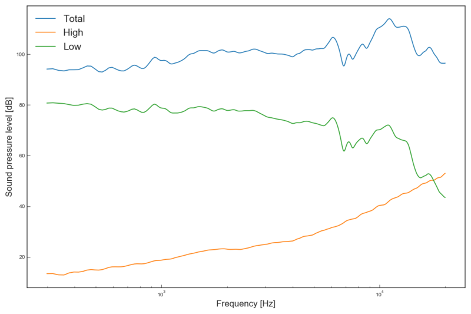

# Crossover

Speaker driver crossover optimisation. Jax is used to compute gradients of the impedance response of the (high and low pass) filters, and the total flatness in the passband is optimised with Adam.

At the moment this only supports two drivers, and only the total frequency response is optimised.



```bash
usage: crossover.py [-h] [-lf LOWFILENAME] [-ld LOWDRIVERNAME]
                    [-hf HIGHFILENAME] [-hd HIGHDRIVERNAME]
                    [--dataDir DATADIR] [--plotName PLOTNAME]
                    [-lr LEARNINGRATE] [-e EPOCHS]

optional arguments:
  -h, --help            show this help message and exit
  -lf LOWFILENAME, --lowFileName LOWFILENAME
                        Low frequency driver FRD file location.
  -ld LOWDRIVERNAME, --lowDriverName LOWDRIVERNAME
                        Low frequency driver name.
  -hf HIGHFILENAME, --highFileName HIGHFILENAME
                        High frequency driver FRD file location.
  -hd HIGHDRIVERNAME, --highDriverName HIGHDRIVERNAME
                        High frequency driver name.
  --dataDir DATADIR     Component data directory.
  --plotName PLOTNAME   Frequency plot name.
  -lr LEARNINGRATE, --learningRate LEARNINGRATE
                        Adam learning rate.
  -e EPOCHS, --epochs EPOCHS
                        Number of epochs to train for.
```
